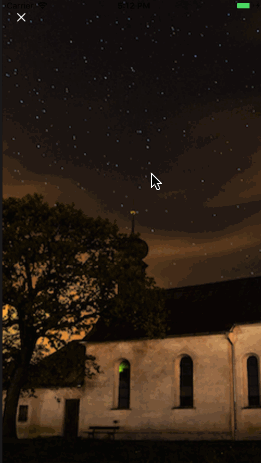

# CustomTransitionDemo
今日头条小视频动画过渡效果实现

### 效果图
 

### 原理
自动定义 `present` 和 `dismiss` 动画,设置 `viewController` 的 `transitioningDelegate` 为自定义类对象(`ImageOpeningTransitioningDelegate`),自己实现过渡动画即可,本文主要讲解`present`自定义过渡实现

### 1.设置 transitioningDelegate 为 self.customTransitioningDelegate,该对象遵循 UIViewControllerTransitioningDelegate 协议,
-------
    ...
    VideoDetailsViewController *detailsViewController = [[VideoDetailsViewController alloc] init];
    detailsViewController.transitioningDelegate = self.customTransitioningDelegate;
    ...
    [self presentViewController:detailsViewController animated:YES completion:nil];

    
### 2.在 present 控制器时,会调用其animationControllerForPresentedController:presentingController: 方法,该方法需要返回一个遵守 UIViewControllerAnimatedTransitioning 协议的对象,这里我们单独抽象出一个类(`ImageOpeningPresenter`),
------
    -(id<UIViewControllerAnimatedTransitioning>)animationControllerForPresentedController:(UIViewController *)presented presentingController:(UIViewController *)presenting sourceController:(UIViewController *)source
    {
    return [ImageOpeningPresenter new];
    }

#### UIViewControllerAnimatedTransitioning 协议需要实现的方法
------
    @protocol UIViewControllerAnimatedTransitioning <NSObject>

    // 过渡动画需要的事件
    - (NSTimeInterval)transitionDuration:(nullable id <UIViewControllerContextTransitioning>)transitionContext;
    // 过渡上下文, transitionContext 包含参与过渡的对象,比如目标控制器和源控制器,拿到这两个控制器我们就可以写交互动画了
    - (void)animateTransition:(id <UIViewControllerContextTransitioning>)transitionContext;

    @optional
    
### 3.重写 animateTransition: 方法
#### 通过 transitionContext 获取源控制器和目标控制器
----
    ViewController *sourceViewController = [transitionContext viewControllerForKey:UITransitionContextFromViewControllerKey];
    VideoDetailsViewController *targetViewController = [transitionContext viewControllerForKey:UITransitionContextToViewControllerKey];
#### 获取 containerView ,这个视图是最底层的 view,相当于整个过渡动画的舞台,所有对象的动画过程都在它上面呈现
------
    UIView *containerView = [transitionContext containerView];
#### 过渡动画代码
------
    /// 完整动画代码在 ImageOpeningPresenter.m 文件 animateTransition: 方法中
    
    NSTimeInterval animationDuration = [self transitionDuration:transitionContext];
    
    ...
    
    [UIView animateWithDuration:animationDuration delay:0.0 options:UIViewAnimationOptionCurveEaseOut animations:^{
        ...
    }
    completion:^(BOOL finished) {
    
        ...
        // 转场结束,这个代码很关键,一定要调用
        [transitionContext completeTransition:![transitionContext transitionWasCancelled]];
        
    }];

### 其他
[仓库地址](https://github.com/TongFangyuan/CustomTransitionDemo)

[How to close a modal by dragging it down](https://www.thorntech.com/2016/02/ios-tutorial-close-modal-dragging/)

